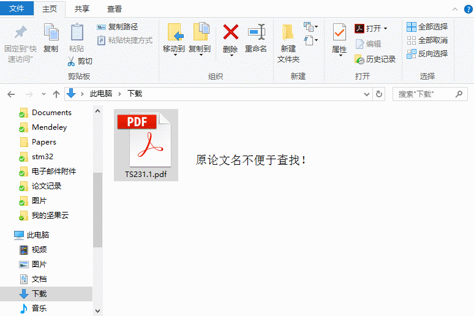

# PaperNamer

将pdf文件名以论文Title进行重命名。

## 安装步骤
1. 首先下载安装Python 3.5 [下载地址](https://www.python.org/ftp/python/3.5.3/python-3.5.3-amd64.exe) 安装完成后，需要重新启动。
2. 双击'install.bat'文件完成安装。
```
# 其中依赖的python包如下，install.bat脚本中将自动安装依赖。
pip install numpy
pip install bs4
```

## 使用说明

在pdf文件上点击右键，选择papernamer完成文件重命名。

